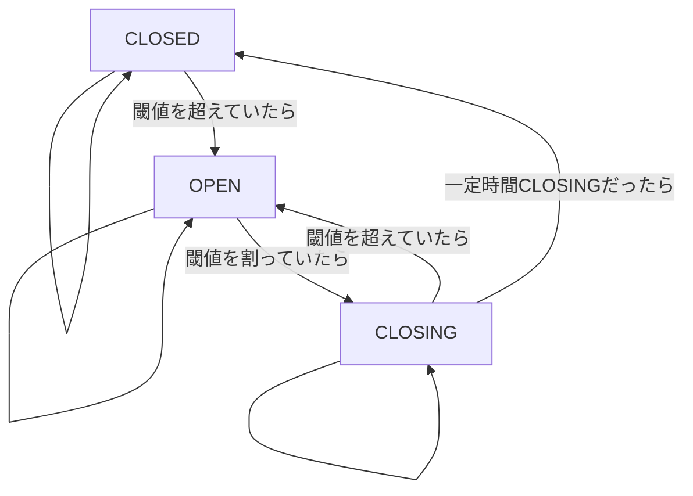

# フロントエンドでのノイズ抑制

traP LT 2022 (2022/03/27)  
@sappi_red

---
hideInToc: true
---

# 目次

<Toc :maxDepth="1" />

---
layout: two-cols
---

# 自己紹介


翠(みどり)  

GitHub: [@sapphi-red](https://github.com/sapphi-red)  
Twitter: [@sapphi_red](https://twitter.com/sapphi_red)  

<v-click>

**traPでの所属**  
SysAd班 (元テクニカルリーダー)  
グラフィック班  

</v-click>
<v-click>

**普段やってること**  
[traQのフロントエンドの開発・保守](https://github.com/traPtitech/traQ_S-UI) など

</v-click>

::right::

<v-click>

**最近やったこと**  
traQのフロントエンドの[自前移行スクリプト](https://github.com/sapphi-red/vue-convert-to-script-setup-from-composition-api)を用いた[`<script setup>`への移行](https://github.com/traPtitech/traQ_S-UI/pull/3140)


</v-click>
<v-click>

[Vite <logos-vitejs /> に開発中のCSS Sourcemapを実装した](https://github.com/vitejs/vite/pull/7173)  
Vite v2.9.0でオプションでの有効化できるようになる予定

<video src="/assets/css-sourcemap.mp4" muted autoplay loop></video>

</v-click>

---

# traQとは

<v-click>

<div class="flex row">
  <div class="w-256">

traPで使われているコミュニケーションツール  

現在は**v3.14.4**  
通称traQ S  

Vue 3(`<script setup>`) <logos-vue />  
TypeScript <logos-typescript-icon />  
Vite <logos-vitejs />

  </div>
  
</div>

</v-click>

---

# Qallの概要

<v-click>

**Qall**: 通話機能のこと

</v-click>
<v-click>

- WebRTCのバックエンド部分は[SkyWay](https://webrtc.ecl.ntt.com/)を利用  
  - 音声情報がバックエンドを介さない


</v-click>

---

### なぜノイズ抑制を実装するのか

<v-click>

[ブラウザ組み込みのノイズ抑制](https://developer.mozilla.org/en-US/docs/Web/API/MediaTrackConstraints/noiseSuppression)を利用していた  

</v-click>
<v-click>

→ノイズが気になるの声

<div class="h-10"></div>

</v-click>
<v-click>

### なぜフロントで実装するのか

<div class="h-4"></div>

</v-click>
<v-clicks>

- 音声情報がバックエンドを介さない
  - → 簡単にバックエンドで処理するようにはできない
    - SkyWayを利用するメリットの半減
    - レイテンシーへの影響 (未検証)
- backendの計算資源を消費
  - → サーバー維持コスト

</v-clicks>

---

# [Web Audio API](https://www.w3.org/TR/webaudio/)

Webフロントエンドにおける音声処理API

AudioNodeというものを組み合わせる

<v-clicks>

- 入力系
- 加工系
- その他

</v-clicks>

---

## 入力系

処理の元となる音声を読み込む

<v-click>

- AudioBufferSourceNode: 音声ファイル
- MediaElementAudioSourceNode: `<audio>` `<video>`
- **MediaStreamAudioSourceNode**: マイクやWebRTC
- OscillatorNode: 波形生成
- ConstantSourceNode: 定数

</v-click>

---

## 加工系

読み込んだ音声を加工する

<v-click>

- GainNode / DynamicsCompressorNode / WaveShaperNode: 音量
- PannerNode / StereoPannerNode: パン(音の位置をずらす)
- ConvolverNode / DelayNode: FIR
- IIRFilterNode / BiquadFilterNode: IIR
- ChannelMergerNode / ChannelSplitterNode: チャンネル操作
- ScriptProcessorNode / **AudioWorkletNode**: 万能

</v-click>

---

## その他

読み込んだ音声を出力するなど

<v-click>

- AnalyserNode: 波形情報取得
- AudioDestinationNode: スピーカーへの出力
- **MediaStreamAudioDestinationNode**: WebRTCへの出力

</v-click>

---

## サンプルコード
```js {all|2|4-6|8-11|12|13|14|18-20|all}
const main = async () => {
  const audioCtx = new AudioContext() // Web Audio APIを利用するために必要

  const res = await fetch('/audio.mp3') // 音声ファイルの取得
  const buffer = await res.arrayBuffer()
  const decodedBuffer = await audioCtx.decodeAudioData(buffer) // ファイルのデコード

  const sourceNode = new AudioBufferSourceNode(
    audioCtx,
    { buffer: decodedBuffer }
  )
  const destNode = audioCtx.destination
  sourceNode.connect(destNode) // 入力を出力につなぐ
  sourceNode.start() // 入力の再生を始める
}

const button = document.querySelector('button')
button.addEventListener('click', () => {
  main() // クリックしたときに実行する
})
```

###### このコードはコンストラクタを利用した書き方を利用しているため、最新のブラウザでしか動作しません

---

# Qallの仕組み

音声の送受信部分に関してのみ

<div class="flex">
  <v-click>
    
  </v-click>
  <v-click>
    
  </v-click>
</div>

<v-after>

###### 音量調整や音量表示に関する部分は省略
###### [より詳しい図](https://github.com/traPtitech/traQ_S-UI/pull/2936) (ただし、今回の発表内容では触れない、置き換え予定の[DTLN-web](https://github.com/sapphi-red/DTLN-web)を利用しています)

</v-after>

<!--
誰が通話に参加しているかどうかの情報については触れない

Media Capture and Streams APIだったりWebRTC APIだったり
-->

---

# AudioWorkletNode

AudioWorkletを利用して自由な音声処理が行えるAudioNode

<v-clicks>

- AudioWorkletで動くAudioWorkletProcessor
- メインスレッドで動くAudioWorkletNode

</v-clicks>

<v-after>

の二つからなる

</v-after>

---

## Workletについて

Web Workerのようにメインスレッド以外での処理を実現

<v-click>

特定の処理に特化している

- AudioWorklet: 音声処理
- PaintWorklet: 画像フィルタ処理

</v-click>

---
layout: two-cols
---

## サンプルコード

メインスレッド側のコード

```js {all|1-6|9-11|12|all}
class MyWorkletNode extends AudioWorkletNode {
  constructor(context) {
    // 右のregisterProcessorと合わせる
    super(context, 'my-worklet-processor');
  }
}

const context = new AudioContext();
await context.audioWorklet.addModule(
  'processors.js' // AudioWorkletへのURL
)
const myWorkletNode = new MyWorkletNode(context);
```

::right::

AudioWorklet側のコード

```js {all|1-11|8-10|13-16|all}
class MyWorkletProcessor
  extends AudioWorkletProcessor {

  constructor() {
    super();
  }

  process(inputs, outputs, parameters) {
    // 処理
  }
}

registerProcessor(
  'my-worklet-processor',
  MyWorkletProcessor
);
```

---

# ノイズ抑制処理

配信ツールである[OBS](https://obsproject.com/ja)で使えるノイズ抑制周りの機能を参考に以下の三つを実装

<v-clicks>

- NoiseGate
  - 閾値よりも大きい音が出ているときだけ音を出力するフィルタ
- Speex preprocessor
  - SpeexDSPというCで書かれたライブラリのノイズ抑制処理
- RNNoise
  - RNNoiseというCで書かれたライブラリのノイズ抑制処理

</v-clicks>

---
layout: two-cols
---

## NoiseGate
```js {all|9-23|10-14|16|18-22|all}
const openCloseStateMachine =
  createOpenCloseStateMachine({
    openThreshold,
    closeThreshold,
    holdMs,
    bufferMs
  })

const process = (input, output) => {
  const channels = input.length
  let inputAverage = 0
  for (let i = 0; i < channels; i++) {
    inputAverage += getRms(input[i]) / channels
  }

  openCloseStateMachine.next(inputAverage)

  if (openCloseStateMachine.isOpen()) {
    for (let i = 0; i < channels; i++) {
      output[i].set(input[i])
    }
  }
}
```

::right::

- `getRms`: 二乗平均平方根(実効値)を求める関数  
- `openCloseStateMachine`: 閾値で状態遷移するステートマシン
  - `.next()`: 遷移する
  - `.isOpen()`: `CLOSING`か`OPEN`のとき

<v-after>



</v-after>

<!--
シンプルなノイズゲート
アタックやリリースと呼ばれる開くとき・閉じるときの音の変わりを滑らかにするものは未実装
-->

---
layout: two-cols
---

## Speex preprocessor
```js {all|18-24|6-16|2,6|all}
import {
  loadSpeexModule,
  SpeexPreprocessor
} from '@sapphi-red/speex-preprocess-wasm'

const speexModule = await loadSpeexModule()
const preprocessors = []
for (let i = 0; i < channels; i++) {
  const preprocessor = new SpeexPreprocessor(
    speexModule,
    128 /* バッファの大きさ */,
    44100 /* サンプリングレート */
  )
  preprocessor.denoise = true
  preprocessors.push(preprocessor)
}

const process = (input, output) => {
  const channels = input.length
  for (let i = 0; i < channels; i++) {
    preprocessors[i].process(input[i])
    output[i].set(input[i])
  }
}
```

::right::

SpeexDSPの`preprocessor`をWasmにビルドしてラップしたものを[`@sapphi-red/speex-preprocess-wasm`](https://github.com/sapphi-red/speex-preprocess-wasm)に実装したのでそれを利用
###### Wasmへのビルドについては今回は触れません

<div class="h-4"></div>

- `loadSpeexModule`
  - Emscriptenで生成される関数
  - 環境に応じてWasmのバイナリを取得してきて初期化処理を行ったりする
    - ブラウザなら`fetch`
    - Node.jsなら`fs`

---
layout: two-cols
---

## RNNoise
```js {all|19-24|14-17|3-12|7,9|3-12|1,14|all}
import { Rnnoise } from '@shiguredo/rnnoise-wasm'

const createSingleProcessor = rnnoiseModule => {
  const denoiseState = rnnoiseModule.createDenoiseState()
  return {
    process: (inputBuffer, outputBuffer) => {
      // 省略: float16の変換やバッファの数合わせの処理
      denoiseState.processFrame(frame)
      // 省略
    }
  }
}

const rnnoiseModule = await Rnnoise.load()
for (i = 0; i < channels; i++) {
  processors.push(createSingleProcessor(rnnoiseModule))
}

const process = (input, output) => {
  const channels = input.length
  for (let i = 0; i < channels; i++) {
    processors[i].process(input[i], output[i])
  }
}
```

::right::

SIMDビルドも含んだものが[`@shiguredo/rnnoise-wasm`](https://github.com/shiguredo/rnnoise-wasm)で公開されていたのでそれを利用

- `Rnnoise.load`
  - Emscriptenで生成される関数
  - `loadSpeexModule`と同様

---

#### [`@shiguredo/noise-suppression`](https://github.com/shiguredo/media-processors/tree/develop/packages/noise-suppression)について

フロントエンドでノイズ抑制機能を行うライブラリ  
`@shiguredo/rnnoise-wasm`を利用している  

<v-click>

**traQで利用しなかった理由**

> 本ライブラリは MediaStreamTrack Insertable Streams (aka Breakout Box) というブラウザの機能を利用しています。 そのため2022年1月現在では、ChromeやEdge等のChromiumベースのブラウザでのみ動作します。  
> ― [`@shiguredo/noise-suppression` サポートブラウザ](https://github.com/shiguredo/media-processors/tree/develop/packages/noise-suppression#%E3%82%B5%E3%83%9D%E3%83%BC%E3%83%88%E3%83%96%E3%83%A9%E3%82%A6%E3%82%B6)

<div class="m-4"></div>

</v-click>
<v-clicks>

- [MediaStreamTrack Insertable Streams](https://caniuse.com/mdn-api_mediastreamtrackgenerator): 62.29% (Chrome 94+) で利用可能
- [Audio Worklet](https://caniuse.com/mdn-api_audioworklet): 92.09% (Chrome 66+、Safari 14.1+、Firefox 76+、iOS Safari 14.5+) で利用可能

</v-clicks>
<v-click>

**Audio Workletの方が利用可能なブラウザが多い**

</v-click>

---

# AudioWorkletでのノイズ抑制処理の利用

いくつかの課題

<v-clicks>

- Audio WorkletでのWasmの読み込み
- Audio Workletのバンドル

</v-clicks>

---

## Audio WorkletでのWasmの読み込み

<div class="m-4"></div>

<v-clicks>

- Audio Worklet内では`fetch`は利用できない[^1]
  - 今後、実装されることもない
- EmscriptenはAudio Worklet用のコードを出力しない
  - 進行中のPRは存在する[^2]
- Emscriptenのメインスレッド用、WebWorker用のコードでは`fetch`を利用している

</v-clicks>
<v-click>

そのままではAudio WorkletでWasmを利用することはできない  
**メインスレッドでWasmを取得して、Audio WorkletにWasmのバイナリデータを送る**  

参考: [Using Audio Worklet with WebAssembly - Audio Worklet Design Pattern | Web | Google Developers](https://developers.google.com/web/updates/2018/06/audio-worklet-design-pattern#using_audio_worklet_with_webassembly)

</v-click>

<div class="m-8"></div>

[^1]: [WebAudio/web-audio-api#1439](https://github.com/WebAudio/web-audio-api/issues/1439)
[^2]: [emscripten-core/emscripten#12502](https://github.com/emscripten-core/emscripten/pull/12502)

<!--
Emscriptenの出力するコードではWasmのバイナリデータを指定することができる
-->

---

## Audio Workletのバンドル

こういうニッチなものでバンドルに影響が出る場合、大体ビルドツール周りがつらい

<div class="m-4"></div>

<v-clicks>

- Webpack 4/5では標準では対応していない[^1]
  - `worker-url`を利用するとよいらしい(?)
  - (あんまり詳しく見てない)
- Viteでは対応している[^2]
  - しかし、トランスパイルは行われるが、バンドルは行われない[^3]

</v-clicks>
<v-click>

**ライブラリ側でバンドルしたファイルを出力する**

</v-click>

<div class="m-8"></div>

[^1]: [webpack/webpack#11543](https://github.com/webpack/webpack/issues/11543)
[^2]: [Explicit URL Imports - Static Asset Handling | Vite](https://vitejs.dev/guide/assets.html#explicit-url-imports), [明示的な URL のインポート - 静的アセットの取り扱い | Vite](https://ja.vitejs.dev/guide/assets.html#%E6%98%8E%E7%A4%BA%E7%9A%84%E3%81%AA-url-%E3%81%AE%E3%82%A4%E3%83%B3%E3%83%9D%E3%83%BC%E3%83%88)
[^3]: [vitejs/vite#6757](https://github.com/vitejs/vite/issues/6757)

<!--
特にWebWorkerやWorkletはバンドルした結果のURLがメインのバンドルに含まれるのがつらい
-->

---
layout: iframe-right
url: https://web-noise-suppressor.sapphi.red/
---

# デモ

https://web-noise-suppressor.sapphi.red/

マイクからの音をノイズ抑制をかけてスピーカーから出力します

---
layout: two-cols
---

# ライブラリの使い方
AudioWorkletやWasm周りのつらさを多少隠ぺいしたライブラリ
[`@sapphi-red/web-noise-suppressor`](https://github.com/sapphi-red/web-noise-suppressor)

<v-click>

```
npm i @sapphi-red/web-noise-suppressor
```

</v-click>

<v-click>

`pkg`は`@sapphi-red/web-noise-suppressor`に読み替えてください

Vite <logos-vitejs /> での例

</v-click>

<v-click>

今はインポートが`dist/*`になってるが、今後[`package.json`の`exports`のsubpath exports](https://nodejs.org/api/packages.html#subpath-exports)を利用して`dist/`をのぞいたパスでのインポートにする予定  
Viteで動かないのでそれを待っている状態 ([vitejs/vite#7098](https://github.com/vitejs/vite/pull/7098))

</v-click>

::right::

<v-after>

```js {all|7|4-5,9-11|2-3,12-13|15-19|1,9-11,20-23|24-25|all}
import { SpeexWorkletNode } from 'pkg'
import speexWorkletPath // workletへのURL
  from 'pkg/dist/speex/workletProcessor?url'
import speexWasmPath // WasmへのURL
  from 'pkg/dist/speex.wasm?url'

const ctx = new AudioContext()

const speexWasmBinary = await loadSpeex({
  url: speexWasmPath
}) // Wasmの読み込み
// Workletの登録
await ctx.audioWorklet.addModule(speexWorkletPath)

const stream =
  await navigator.mediaDevices.getUserMedia({
    audio: true
  }) // マイクの取得
const source = ctx.createMediaStreamSource(stream)
const speex = new SpeexWorkletNode(ctx, {
  wasmBinary: speexWasmBinary,
  maxChannels: 2
}) // speexでのノイズ抑制
source.connect(speex)
speex.connect(ctx.destination)
```

</v-after>

---

# 最後に

<v-click>

一般的なフロントの知識だけでなく

</v-click>
<v-clicks>

- 音声処理
- Worklet
- Wasm / Emscripten

</v-clicks>
<v-click>

あたりの知識も必要で大変だった

</v-click>
